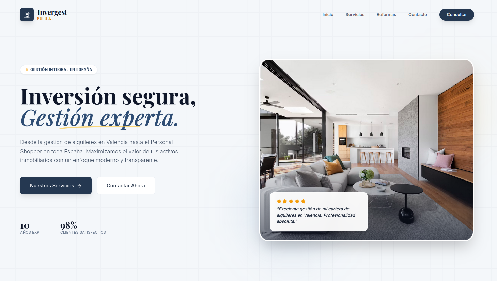

<div align="center">
  
</div>

# Invergest PSI S.L. – Gestión Inmobiliaria Integral

Bienvenido al repositorio oficial de **Invergest PSI S.L.**, una plataforma web moderna y profesional para la gestión integral de inversiones inmobiliarias en España.

## 🚀 Descripción

Invergest PSI S.L. ofrece soluciones innovadoras para la gestión de alquileres, personal shopper inmobiliario y reformas, con un enfoque transparente, eficiente y orientado al cliente. Nuestra plataforma maximiza el valor de los activos inmobiliarios, combinando tecnología y experiencia para brindar un servicio de excelencia.

## 🖥️ Vista previa

<div align="center">
  
</div>

## ⚙️ Instalación y uso local

**Requisitos:** Node.js

1. Instala las dependencias:
   ```bash
   npm install
   ```
2. Si usas la integración con Gemini, crea un archivo `.env.local` y agrega tu clave:
   ```env
   GEMINI_API_KEY=tu_clave_aqui
   ```
3. Inicia la aplicación en modo desarrollo:
   ```bash
   npm run dev
   ```

---

© 2025 Invergest PSI S.L. | Desarrollado por @dgimenezdeveloper | Todos los derechos reservados
